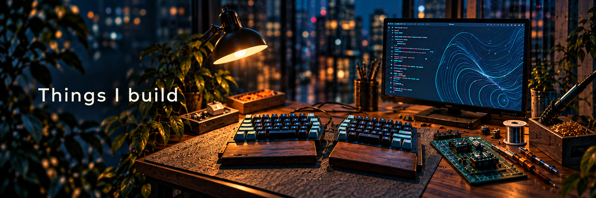

# Hi, I’m Justin.

**A maker and engineering leader based in Tokyo.**

[日本語はこちら](#日本語) · [Say hello](https://cyber-lane.com/)

## 

I love creating things. Software, electronics, game engines, games. My curiosity takes me in plenty of directions, and I enjoy following an idea to see what it might become.

Professionally, I’m Head of Engineering at [Looop](https://looop.co.jp/), seconded to [Glamo](https://www.glamo.co.jp/).

## 

Some ideas live on a screen. Others involve circuit boards, solder, and a desk covered in parts.

I enjoy building useful tools, creating games and the engines behind them, and experimenting with ideas simply because they seem interesting. Learning how to make something is often part of the appeal.

## 

I love being around creative people. People who make things, explore unusual ideas, or get excited explaining something they care about.

Outside of building, I enjoy languages, travel, discovering different cultures, and a good cup of coffee.

Whether you’re a fellow maker, a potential collaborator, or just someone with an interesting idea, [I’d love to hear from you](https://cyber-lane.com/).

---

日本語はこちら · ジャスティンについて

### はじめまして、ジャスティンです。

東京を拠点に、ものづくりとエンジニアリング組織のリードに取り組んでいます。

### 自己紹介

何かをつくることが大好きです。ソフトウェア、電子工作、ゲームエンジン、ゲーム。興味の向く先はさまざまで、思いついたアイデアがどんな形になるのか、試しながら探っていくのを楽しんでいます。

仕事では、[Looop](https://looop.co.jp/)の Head of Engineering として、[Glamo（グラモ）](https://www.glamo.co.jp/)に出向しています。

### つくるもの

画面の中で形になるアイデアもあれば、回路基板やはんだ、部品でいっぱいの机から生まれるものもあります。

便利なツールをつくったり、ゲームやその土台となるエンジンを開発したり。「面白そう」という気持ちから、いろいろなアイデアを試しています。つくり方を学ぶこと自体も、楽しみのひとつです。

### ものづくりのほかに

何かをつくる人、ユニークなアイデアを探求する人、好きなことを夢中で語る人。そんなクリエイティブな人たちと過ごす時間が好きです。

ものづくり以外では、語学や旅行、さまざまな文化に触れること、そしておいしいコーヒーを楽しんでいます。

ものづくりが好きな方、一緒に何かをつくってみたい方、面白いアイデアを話したい方。仕事のご相談も含めて、[気軽に声をかけてください](https://cyber-lane.com/)。

---

**七転び八起き**

Fall seven times, stand up eight.
